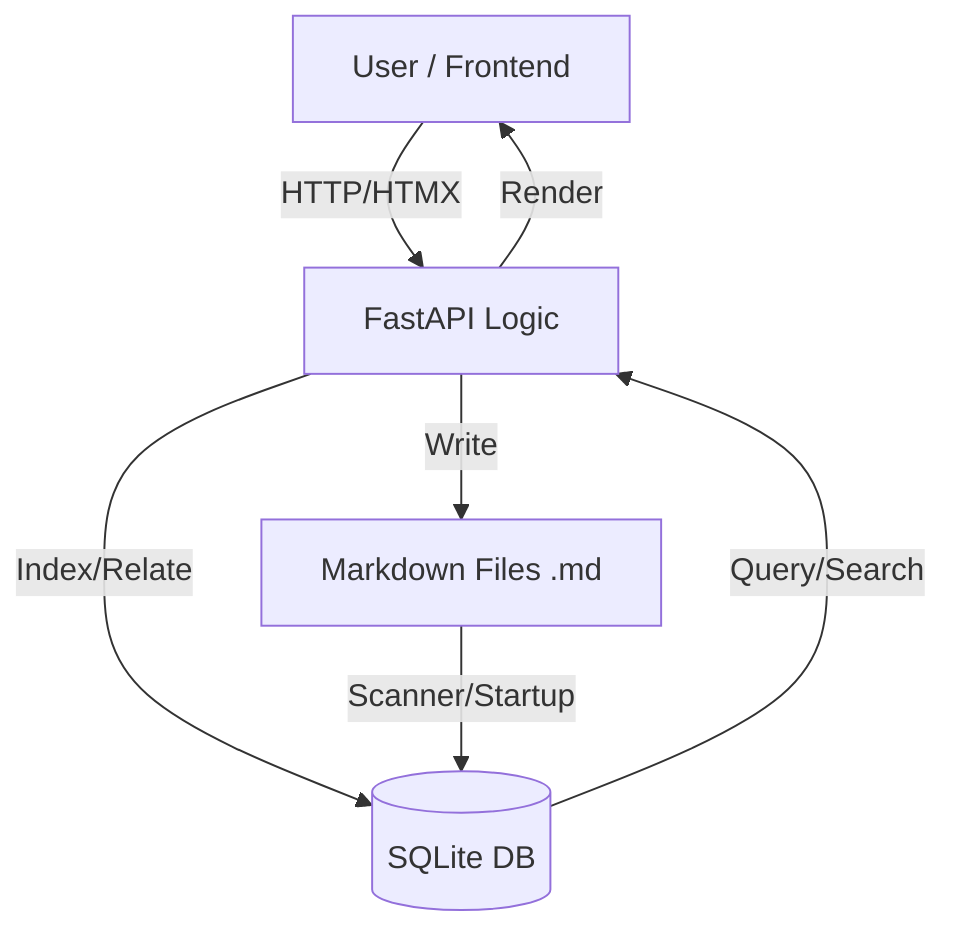

# Novel Hub C-Route Architecture (v6)

## 1. Overview & Data Flow
Novel Hub follows a **File-as-Truth, DB-as-Index** philosophy. Markdown files in the vault are the primary source of truth for content, while the SQLite database provides high-performance indexing, relational tracking, and complex metadata management.

### Data Flow Diagram

- **Consistency Policy**: 
    - Every file write (`write_markdown`) triggers a database update (`file_index`, `chapter_fts`).
    - Entity metadata is stored in the DB (`entities`), but detailed descriptions are still kept in `.md` files in `characters/`, `world/`, etc., for external editing compatibility.
    - Scenes are logical divisions within a chapter `.md` (marked by `## ` headers) and are indexed into the `scenes` table upon saving the chapter.

## 2. Entity Model
Entities replace the legacy unstructured notes. Every entity has a unique ID (`ent_xxxxxxxx`) and belongs to a specific `kind`.

### Entity Types & Attributes (Properties JSON)
| Kind | Core Purpose | Specific Attributes (JSON) |
|---|---|---|
| **Character** | People/Creatures | `gender`, `age`, `birth`, `death`, `mbti`, `height`, `appearance`, `personality`, `motivation` |
| **Location** | Setting/Geography | `parent_id` (nested), `climate`, `map_url`, `population`, `security_level` |
| **Item** | Artifacts/Tools | `owner_id`, `rarity`, `function`, `origins` |
| **Organization** | Groups/Guilds | `leader_id`, `headquarters`, `alignment`, `size` |
| **Thread** | Plot lines / Hooks | `status` (open/resolving/closed), `impact_level`, `start_chapter`, `end_chapter` |
| **Concept** | Magic/Systems/Lore | `system_type`, `limitations`, `prevalence` |
| **Event** | Historical / Major | `timestamp`, `participants`, `outcome`, `historical_significance` |

## 3. Wiki Link Syntax Specification
Novel Hub supports internal linking using the double-bracket syntax.

### Parsing Rules
- `[[Name]]`: Matches an entity by its primary `name` or `aliases`.
- `[[Name|Display Text]]`: Matches entity by `name` but displays `Display Text`.
- `[[ent_id]]`: Direct ID link (permanent, survives renames).
- `[[ent_id|Display Text]]`: Preferred format for robust version control.
- `[[Name#Anchor]]`: Links to a specific section (H2 scene) within an entity or chapter.

**Ambiguity Resolution**: If multiple entities share the same name/alias, the system marks the reference as `ambiguous` and requires manual ID binding via the UI.

## 4. Scene Model
Scenes are not separate files. They are segments within a chapter file delimited by `## Scene Title`.

- **Indexing**: The system records `char_offset_start` and `char_offset_end` for each H2 block.
- **Granular Editing**: The UI can "break" a large chapter into scenes for focused writing while saving back to a single `.md` file.
- **POV Tracking**: Scenes have a dedicated `POV` field in the DB, allowing for density analysis in the timeline view.

## 5. Migration Strategy (v5 to v6)
1. **Snapshot**: Create a full backup of the `vault/` and `novelhub.db`.
2. **Entity Creation**: Scan `characters/`, `world/`, and `hooks/`.
    - Create a row in `entities` for each file.
    - Generate `id = sha1(rel_path)[:8]`.
    - Map `kind` based on folder and frontmatter `category`.
3. **Reference Mapping**: 
    - Parse existing `characters: [...]` and `tags: [...]` in chapter frontmatter.
    - Attempt to bind names to the newly created `entities.id`.
4. **Cleanup**: Keep the original `.md` files but treat the `entities` table as the primary registry for metadata.
