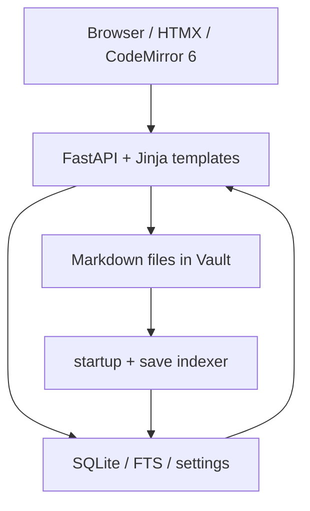

# Novel Hub v14 Architecture

## 核心原则

Novel Hub 采用 **File-as-Truth, DB-as-Index**：

- Markdown 文件是正文与可外部编辑内容的真实来源
- SQLite 保存索引、统计、搜索、实体、场景、快照、设置与操作日志
- 每次文件写入后同步更新索引
- 高级模块通过 feature flag 控制，默认关闭



## 编辑保存链路

1. 编辑器提交正文、frontmatter 字段、`loaded_mtime`
2. 服务端读取当前文件 mtime
3. 若当前文件已被外部修改且未显式 `force=true`，返回 `chapter_conflict`
4. 前端提示用户确认
5. 强制覆盖时先创建 `pre_overwrite` 快照
6. `write_markdown()` 用临时文件 + `os.replace()` 原子写入
7. 写入后更新 `file_index`、FTS、场景/实体引用等索引
8. 返回新的 `mtime`，前端更新隐藏字段，避免下一次误报冲突

## Feature Flags

默认关闭：

- `NOVELHUB_FEATURE_AI`
- `NOVELHUB_FEATURE_AI_CHECK`
- `NOVELHUB_FEATURE_GRAPH`
- `NOVELHUB_FEATURE_TIMELINE`
- `NOVELHUB_FEATURE_SCENES`
- `NOVELHUB_FEATURE_THREADS`

关闭时对应 UI 不展示，对应 API/页面返回 `404`。这让基础写作、实体、搜索、导出等稳定链路不被实验模块影响。

## 设置与密钥

AI API Key 通过 Fernet 加密后写入 `settings` 表。设置页只显示“已配置/未配置”，不会回显完整 key。

生产环境下必须设置非默认的：

- `NOVELHUB_PASSWORD`
- `NOVELHUB_SECRET_KEY`
- `NOVELHUB_ENCRYPTION_KEY`

## 移动端

编辑器在小屏下不直接开放编辑，而是显示只读视图入口：

```text
/projects/{project}/chapters/{filename}/read
```

顶栏在小屏切换为抽屉导航。
